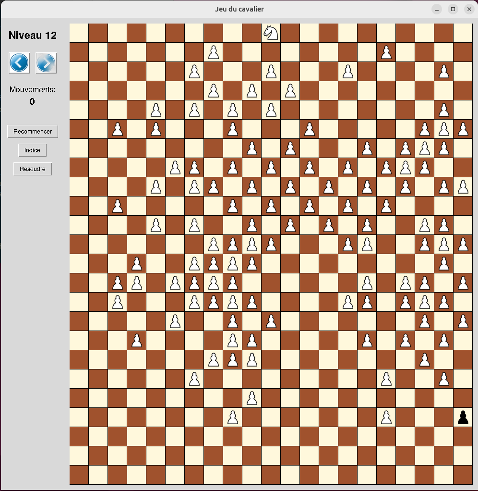

# JeuCavalier

Jeu de parcours de cavalier sur un échiquier encombré. Programme
pédagogique du cours d'algorithmique de 1ère année de licence
d'informatique dont le but est d'emmener le cavalier blanc jusqu'au
pion noir. 

Le challenge de programmation consistait à trouver pour chaque puzzle le
chemin le plus court.

